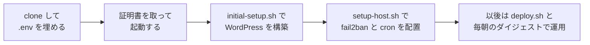
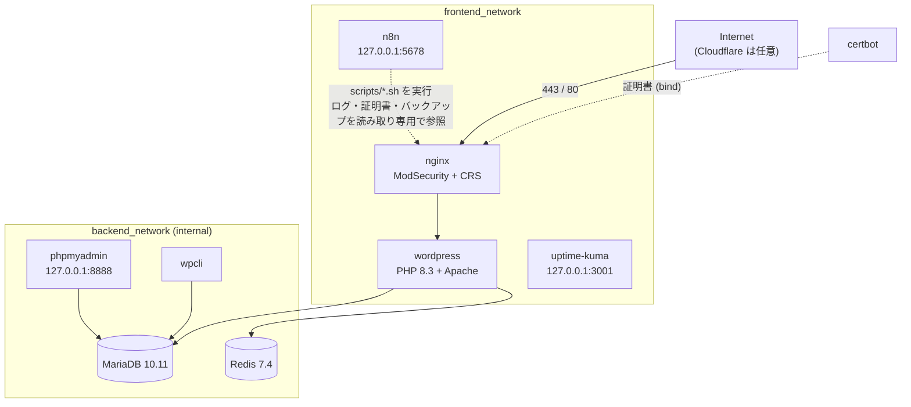

# docker_wordpress

> Production-ready WordPress stack on Docker Compose — WAF, Redis, backups, monitoring, and one-command setup included.

[](https://github.com/makoto-kamimura/docker_wordpress/actions/workflows/ci.yml)
[](./LICENSE)
[](https://docs.docker.com/compose/)
[](https://wordpress.org/)
[](https://mariadb.org/)
[](https://www.php.net/)
[](https://redis.io/)
[](https://coreruleset.org/)

ポートフォリオ / 中規模ブログを **1 VM** で本番運用するための WordPress スタック。よくある「とりあえず WordPress を Docker で動かしてみた」段階から、**WAF / シークレット分離 / ネットワーク二段分離 / 自動デプロイ / バックアップ / 監視** まで一通り入った状態を、数コマンドで展開できる。

## コンセプト

WordPress を Docker で動かすだけなら数行の compose で済む。しかしそのまま公開すると、DB がホストのポートに出ていたり、`xmlrpc.php` やユーザー列挙が素通しだったり、パスワードが compose に平文で書かれていたりする。さらに、証明書の更新・バックアップ・デプロイ・ログの監視は「あとでやる」になりがちで、止まっていても誰も気づかない。

docker_wordpress は、**公開に必要な守りと運用を最初から揃えた状態で配る**ことで、この手間をなくす。

| 考え方 | 内容 |
|---|---|
| 外に開くのは 443 だけ | 外部との接点は WAF 付きの Nginx だけにする。DB と Redis は外部からも Nginx からも届かないネットワークに置く |
| 秘密は `.env` に一か所 | パスワード・Salt・API キーはすべて `platform/.env`（git 管理外）に集め、コードとイメージには持たせない |
| 数コマンドで同じ構成に | 証明書の取得から WordPress の初期設定・プラグイン・キャッシュまで、スクリプトで冪等に組み立てる |
| 止めずに変える | 設定の変更は reload で済ませ、デプロイは失敗したら自動でロールバックする |
| 黙って止まらせない | バックアップ・証明書・WAF・fail2ban の状態を毎朝まとめて知らせ、異常だけを先頭に出す |

| 項目 | 内容 |
|---|---|
| ステータス | **本番運用中**（作成者のポートフォリオサイトで稼働。[ロードマップ](#6-開発ロードマップ)の Phase 3 まで完了） |
| 対象 | 1 台の VM（RAM 数 GB）で WordPress を公開する個人・小規模チーム |
| 作成者 | **Makoto Kamimura** — [@makoto-kamimura](https://github.com/makoto-kamimura) |

このREADMEは、プロジェクト紹介と仕様書を兼ね、次の2部と付録で構成する。

| 部 | 内容 | 主な読者 |
|---|---|---|
| [第1部 概要説明](#第1部-概要説明) | 目的、構成サービス、基本フロー、テーマ、ロードマップ | すべての人 |
| [第2部 技術説明](#第2部-技術説明) | 技術スタック、システム構成、クイックスタート、ネットワーク、ボリューム、実装方針、非機能要件 | 開発者・運用者 |
| [付録](#付録) | 決定事項、未決事項 | すべての人 |

## 目次

- [コンセプト](#コンセプト)
- [第1部 概要説明](#第1部-概要説明)
  - [特徴](#特徴) / [使い方のイメージ](#使い方のイメージ)
  - [1. 概要](#1-概要) / [2. 用語](#2-用語) / [3. 構成サービス](#3-構成サービス) / [4. 基本フロー](#4-基本フロー)
  - [5. テーマ](#5-テーマ) / [6. 開発ロードマップ](#6-開発ロードマップ)
- [第2部 技術説明](#第2部-技術説明)
  - [7. 技術スタックとシステム構成](#7-技術スタックとシステム構成)（[クイックスタート](#76-クイックスタート)を含む）
  - [8. ネットワーク](#8-ネットワーク) / [9. ボリュームと bind マウント](#9-ボリュームと-bind-マウント) / [10. 機能ごとの実装方針](#10-機能ごとの実装方針) / [11. 非機能要件](#11-非機能要件)
- [付録](#付録)
  - [12. 決定事項](#12-決定事項) / [13. 未決事項](#13-未決事項)
- [ドキュメント](#ドキュメント) / [Contributing](#contributing) / [License](#license)

---

# 第1部 概要説明

スタックの目的・構成・使い方をまとめる。技術的な内容は[第2部](#第2部-技術説明)に分ける。

## 特徴

| 特徴 | 内容 |
|---|---|
| Reverse proxy + WAF | Nginx + OWASP ModSecurity CRS。WordPress 向けの誤検知除外を範囲を絞って同梱 |
| DB | MariaDB 10.11 LTS（MySQL 5.7 EOL からの移行先） |
| Object cache | Redis 7（`requirepass`、読み取り専用コンテナ） |
| TLS | Let's Encrypt の自動更新 + 更新後の nginx 自動 reload、TLSv1.2/1.3、OCSP stapling、HSTS |
| WP-CLI による自動構築 | 初回セットアップ・プラグイン・Salt・SMTP を 1 コマンドで |
| バックアップ | WordPress DB と uploads を日次 cron で取得・世代管理 |
| 監視 | Uptime Kuma（セルフホスト外形監視）、毎朝の運用ダイジェストと WAF の閾値アラートをメールで通知 |
| AI からの照会 | n8n を MCP サーバーにして、WAF 検知・アクセス・fail2ban・証明書の状態を Claude Code などから聞ける |
| ホストの守り | fail2ban（ModSecurity の遮断・wp-login の総当たり）、SSH ポート変更、cron 配置を 1 スクリプトで |
| デプロイ | `scripts/deploy.sh` + GitHub Actions `workflow_dispatch`。失敗時は自動ロールバック |
| CI | `docker compose config` / ShellCheck / Trivy（イメージの脆弱性を週次スキャンし code scanning へ） |
| Cloudflare 対応 | `set_real_ip_from` の全レンジを同梱 + 月次の IP 更新スクリプト |

## 使い方のイメージ



目標は、**DNS を向けたサーバーで、初回の公開までを 30 分以内に終えられること**である。

## 1. 概要

### 1.1 ポジショニング

「WordPress の公式イメージを compose で並べただけのサンプル」と「マネージドな WordPress ホスティング」の中間に位置付ける。

| 比べる相手 | 足りないもの | 本スタックでの形 |
|---|---|---|
| compose のサンプル | WAF、ネットワーク分離、シークレット管理、証明書更新、バックアップ、監視 | すべて同梱し、既定で有効にする（[第10章](#10-機能ごとの実装方針)） |
| マネージド WordPress | 構成の自由度、同じ VM での別アプリ同居、コストの見通し | 1 VM・Docker Compose だけで完結し、追加アプリは overlay で載せる（[D7](#12-決定事項)） |

### 1.2 原則

**外部に開くのは Nginx の 443（と ACME 用の 80）だけ。それ以外はすべて内側に閉じる。** 管理用の画面（phpMyAdmin・Uptime Kuma・n8n）も `127.0.0.1` にだけバインドし、SSH トンネル経由で使う。

### 1.3 想定ユースケース

| ユースケース | 使い方 |
|---|---|
| 個人のポートフォリオ | 好みのテーマを置いて、制作物とブログを公開する |
| 中規模のブログ | Redis のオブジェクトキャッシュと Cloudflare 前段で、1 VM のままアクセス増に耐える |
| 制作物のデモを同じサーバーで公開 | `docker-compose.demo.yml` の overlay でサブドメインごとに別アプリを載せ、同じ WAF を通す |

## 2. 用語

| 用語 | 意味 |
|---|---|
| profile | Docker Compose の起動グループ。常駐サービス以外は `--profile <名前>` を付けたときだけ起動する |
| CRS | OWASP Core Rule Set。ModSecurity 用の汎用 WAF ルール集。リクエストごとに匿名スコアを加算し、しきい値を超えたら遮断する |
| 除外ルール | CRS の誤検知を、パス・ヘッダ・ドメインを絞って外すルール。`nginx_data/modsec-rules/` に置く |
| `backend_network` | DB と Redis を置く内部ネットワーク（`internal: true`）。外部にも Nginx にもつながらない |
| overlay | `docker-compose.yml` に重ねて読む追加の compose ファイル。本スタックでは `docker-compose.demo.yml`（git 管理外）を使う |
| 運用ダイジェスト | `ops-digest.sh` の出力。WAF・fail2ban・証明書・バックアップ・ディスクを 1 通にまとめ、要対応を先頭に出す |
| MCP | Model Context Protocol。AI アシスタントが外部のツールを呼ぶための仕組み。本スタックでは n8n が MCP サーバーになる |

## 3. 構成サービス

[platform/docker-compose.yml](platform/docker-compose.yml) に 10 サービスを定義する（常駐 5 + profile 起動 5）。

| サービス | イメージ | profile | 役割 | 公開ポート |
|---|---|---|---|---|
| `db` | `mariadb:10.11.13` | 常駐 | DB | 内部のみ |
| `wordpress` | `wordpress:6.7.2-php8.3-apache` | 常駐 | WordPress 本体 | 内部のみ |
| `redis` | `redis:7.4.2-alpine` | 常駐 | オブジェクトキャッシュ | 内部のみ |
| `nginx` | `owasp/modsecurity-crs:nginx-alpine` | 常駐 | リバースプロキシ + WAF | **80 / 443** |
| `certbot` | `certbot/certbot:v2.11.0` | 常駐 | Let's Encrypt の更新ループ | - |
| `phpmyadmin` | `phpmyadmin/phpmyadmin:5.2.1` | `admin` | DB 管理 | `127.0.0.1:8888` |
| `webalizer` | `toughiq/webalizer:latest` | `stats` | アクセスログ解析 | 内部のみ |
| `wpcli` | `wordpress:cli-2.10.0-php8.3` | `cli` | 自動構築・運用 | 内部のみ |
| `uptime-kuma` | `louislam/uptime-kuma:1.23.13` | `monitoring` | 外形監視 | `127.0.0.1:3001` |
| `n8n` | `docker.n8n.io/n8nio/n8n:2.41.0` | `automation` | MCP サーバー・通知の定期実行 | `127.0.0.1:5678` |

最小構成は `db / wordpress / redis / nginx / certbot` の 5 サービスである。

## 4. 基本フロー

コマンドは `platform/` で実行する。

### 4.1 はじめて構築する

1. `.env.example` を `.env` にコピーし、ドメイン・メールアドレス・パスワード・Salt を埋める
2. `init-dirs.sh` でディレクトリと権限を用意し、Nginx だけ先に起動して証明書を取る
3. 全サービスを起動し、`initial-setup.sh` で WordPress を構築する
4. `setup-host.sh` で fail2ban・SSH ポート・cron を配置する

コマンドは[クイックスタート](#76-クイックスタート)にまとめる。

### 4.2 更新を取り込む（git pull 後の再起動）

```bash
git pull --ff-only
sudo ./scripts/init-dirs.sh          # root で作業した後の権限ズレを直す
sudo docker compose up -d --remove-orphans
```

`scripts/deploy.sh` はこの流れに、事前のバックアップ・ヘルスチェック・失敗時の自動ロールバックを加えたものである（[10.6節](#106-デプロイとロールバック)）。

### 4.3 nginx の設定を変える

```bash
$EDITOR nginx_conf/conf.d/default.conf.template   # バージョン管理下のテンプレートを編集する
sudo docker compose restart nginx                  # 起動時にテンプレートから再展開される
```

`nginx_data/conf.d/default.conf` はコンテナが起動時に自動生成する。root で直接作成・上書きすると、nginx が Permission denied で起動できなくなる。

### 4.4 デプロイする

```bash
sudo REF=origin/master ./scripts/deploy.sh
```

GitHub Actions の **Run workflow**（`deploy.yml`）からも実行できる。

### 4.5 バックアップと復元

cron（`setup-host.sh` が `/etc/cron.d/` に配置）で毎日取得する。

| 時刻 | スクリプト | 対象 | 保管先 |
|---|---|---|---|
| 03:00 | `backup-db.sh` | WordPress DB（`mariadb-dump` + gzip） | `app/backup/` |
| 03:20 | `backup-files.sh` | `wp-content/uploads`（+ `platform/backup-files.targets` に書いた追加対象） | `app/backup/files/` |

復元は `gunzip -c <ダンプ> | docker compose exec -T db mariadb ...`、ファイルは `tar -xzf <書庫> -C <戻したい場所>` で行う。

### 4.6 監視と通知

| 手段 | 何を見るか | 通知 |
|---|---|---|
| Uptime Kuma | サイトの外形（HTTP・証明書） | 管理画面で Slack / Discord / メールを設定 |
| 運用ダイジェスト（n8n） | WAF・fail2ban・証明書・アクセス・バックアップ・ディスク | 毎朝 7:00 にメール。閾値を超えた項目は冒頭の【要対応】に出る |
| WAF 閾値アラート（n8n） | 同一 IP からの遮断件数 | 1 時間に既定 30 件を超えたらメール（同じ IP は 6 時間再通知しない） |
| MCP ツール（n8n） | 上の各項目を AI から照会 | - |

n8n の設定は [platform/n8n/README.md](platform/n8n/README.md) を参照。

## 5. テーマ

テーマは本リポジトリに含めない。`app/wordpress/wordpress_data/wp-content/themes/` に置き（git 管理外）、`.env` の `THEME_SLUG` にディレクトリ名を書くと、`initial-setup.sh` が有効にする。未設定なら有効化は行わず、WordPress の既定テーマのままになる。

テーマの更新はテーマ側のリポジトリやアップロードで行い、本スタックのデプロイ（`deploy.sh`）では触らない。テーマ独自の REST API などで WAF の誤検知が出る場合は、git 管理外の除外ルールで外す（[10.1節](#101-waf-と除外ルール)）。

## 6. 開発ロードマップ

| Phase | 内容 | 状態 |
|---|---|---|
| 0 | WordPress + MySQL + Nginx の compose、Let's Encrypt、phpMyAdmin・Webalizer | 完了（2021〜2024） |
| 1 | 本番化: MariaDB 移行、ModSecurity + CRS、ネットワーク二段分離、シークレットの `.env` 集約、wp-cli 自動構築 | 完了（2026-05） |
| 2 | 運用の自動化: deploy.sh と自動ロールバック、CI（ShellCheck・Trivy）、fail2ban とホスト設定、証明書更新後の自動 reload、cron のリポジトリ管理 | 完了（2026-07〜09） |
| 3 | 運用の見える化: 運用ダイジェスト、WAF 閾値アラート、MCP による照会、uploads のバックアップ | 完了（2026-09） |
| 4 | 守りと復旧の強化: バックアップの外部保管、CSP の本適用、nginx ログのローテーション | 未着手（[未決事項](#13-未決事項)） |

---

# 第2部 技術説明

## 7. 技術スタックとシステム構成

### 7.1 技術スタック

| 層 | 採用 | 備考 |
|---|---|---|
| コンテナ | Docker Engine 24+ / Docker Compose v2 | profile と overlay で構成を切り替える |
| リバースプロキシ / WAF | Nginx + ModSecurity v3 + OWASP CRS | `owasp/modsecurity-crs:nginx-alpine` |
| アプリ | WordPress 6.7 / PHP 8.3 / Apache | イメージのタグは固定し、`:latest` は使わない（webalizer を除く） |
| DB | MariaDB 10.11 LTS | |
| キャッシュ | Redis 7.4 | Redis Object Cache プラグインから使う |
| 証明書 | Let's Encrypt（certbot, webroot 方式） | |
| 運用自動化 | シェルスクリプト（bash / POSIX sh + awk）、cron、n8n | 集計ロジックはスクリプト側に置き、n8n は薄い層にする |
| ホスト防御 | fail2ban | ModSecurity の遮断と wp-login の総当たりを BAN |
| CI / CD | GitHub Actions | CI は push / PR / 週次、デプロイは `workflow_dispatch` |

### 7.2 システム構成



`docker-compose.demo.yml`（overlay）を重ねると、Nginx が `proxy_network` にも参加し、サブドメインごとの追加アプリへ転送する。追加アプリの DB は、それぞれ専用の `internal` ネットワークに置く。

### 7.3 リポジトリ構成

```
docker_wordpress/
├── app/                                # 永続データ (DB / WordPress / ログ / バックアップ。テーマもここに置く)
├── platform/                           # 基盤定義
│   ├── docker-compose.yml              # 10 サービス + profile
│   ├── docker-compose.demo.yml.template  # overlay のひな形 (実体の .yml は git 管理外)
│   ├── .env.example                    # シークレットのテンプレート (.env は git 管理外)
│   ├── host-secrets.env.example        # SSH ポート・管理者 IP のテンプレート
│   ├── nginx_conf/conf.d/              # nginx テンプレート (.template / .public / .local / cloudflare-realip)
│   ├── nginx_data/                     # 実行時マウント (証明書 / 生成済み conf / WAF 除外ルール)
│   ├── php_conf/uploads.ini            # PHP の上書き設定
│   ├── fail2ban/                       # jail / filter (setup-host.sh が配置)
│   ├── cron.d/                         # cron 定義 (setup-host.sh が /etc/cron.d へ配置)
│   ├── n8n/                            # MCP ツール / 通知ワークフローの定義と手順
│   └── scripts/
│       ├── init-dirs.sh                # ディレクトリ作成・権限設定
│       ├── initial-setup.sh            # wp-cli で WordPress を冪等に構築
│       ├── setup-host.sh               # fail2ban・SSH ポート・cron の配置
│       ├── deploy.sh                   # バックアップ → 更新 → ヘルスチェック → 失敗時ロールバック
│       ├── backup-db.sh / backup-files.sh
│       ├── ops-digest.sh               # 運用ダイジェスト
│       ├── waf-report.sh / access-summary.sh / fail2ban-status.sh / cert-expiry.sh  # ダイジェストと MCP の実体
│       ├── reload-nginx-on-cert-renew.sh / update-cloudflare-ips.sh
│       ├── docker-cleanup.sh / vscode-server-cleanup.sh
│       └── lib/                        # 共通関数 (bash 用 common.sh / POSIX sh 用 report-common.sh)
├── docs/                               # 設計・運用手順・障害記録 (中身は git 管理外。docs/README.md 参照)
└── .github/workflows/
    ├── ci.yml                          # compose / ShellCheck / Trivy
    └── deploy.yml                      # workflow_dispatch (SSH 経由で deploy.sh)
```

変化の多いデータ（`app/`）と、比較的安定した基盤定義（`platform/`）を分ける。バックアップの対象は `app/`、構成変更のレビュー対象は `platform/` である。

### 7.4 Docker Compose の構成

| 起動のしかた | 起動するサービス |
|---|---|
| `docker compose up -d` | `db` / `wordpress` / `redis` / `nginx` / `certbot` |
| `--profile admin` | + `phpmyadmin` |
| `--profile stats` | + `webalizer` |
| `--profile cli` | + `wpcli`（`run --rm` で都度起動） |
| `--profile monitoring` | + `uptime-kuma` |
| `--profile automation` | + `n8n` |
| `-f docker-compose.yml -f docker-compose.demo.yml` | + overlay に書いた追加アプリ（`.env` の `COMPOSE_FILE` に書いておけば `-f` は省略できる） |

### 7.5 環境変数

`platform/.env`（`.env.example` からコピー）にまとめる。主なものは次のとおり。

| グループ | 変数 |
|---|---|
| ドメイン | `PUBLIC_DOMAIN` / `LETSENCRYPT_EMAIL` |
| DB | `MYSQL_ROOT_PASSWORD` / `MYSQL_DATABASE` / `MYSQL_USER` / `MYSQL_PASSWORD` |
| WordPress | `WP_TABLE_PREFIX`、Salt 8 個（`WP_AUTH_KEY` 〜 `WP_NONCE_SALT`） |
| Redis | `REDIS_PASSWORD` |
| SMTP | `SMTP_HOST` / `SMTP_PORT` / `SMTP_USER` / `SMTP_PASS` / `SMTP_FROM_EMAIL` など |
| リソース | `WP_MEM_LIMIT` / `DB_MEM_LIMIT` / `NGINX_MEM_LIMIT` / `N8N_MEM_LIMIT` |
| n8n と通知 | `N8N_ENCRYPTION_KEY` / `OPS_ALERT_EMAIL_TO` / `WAF_ALERT_THRESHOLD` / `WAF_ALERT_COOLDOWN_HOURS` |

SSH ポートと管理者の接続元 IP は、公開リポジトリに載せないため `platform/host-secrets.env`（git 管理外）に分ける。

### 7.6 クイックスタート

前提:

- Docker Engine 24+ または Docker Desktop 4.x（compose v2 同梱）
- 公開ドメインの DNS A レコードをサーバーの IP に向けてある
- （任意）Cloudflare を前段に置くなら DNS は Cloudflare 経由にする

```bash
# 1. シークレットを用意する
git clone https://github.com/makoto-kamimura/docker_wordpress.git
cd docker_wordpress/platform
cp .env.example .env
$EDITOR .env       # PUBLIC_DOMAIN / LETSENCRYPT_EMAIL / パスワード / Salt を埋める (テーマを使うなら THEME_SLUG も)

# Salt キーの生成
for k in WP_AUTH_KEY WP_SECURE_AUTH_KEY WP_LOGGED_IN_KEY WP_NONCE_KEY \
         WP_AUTH_SALT WP_SECURE_AUTH_SALT WP_LOGGED_IN_SALT WP_NONCE_SALT; do
  printf "%s=%s\n" "$k" "$(LC_ALL=C tr -dc 'A-Za-z0-9!@#%^*()_+=-' </dev/urandom | head -c 64)"
done

# 2. ディレクトリと権限を用意する (nginx コンテナ uid=101 が conf.d・certs を読み書きできるように)
sudo ./scripts/init-dirs.sh

# 3. ACME チャレンジ用に nginx だけ先に起動し、証明書を取る
sudo docker compose up -d nginx
sudo docker compose run --rm --entrypoint="" certbot certbot certonly \
  --webroot --webroot-path=/usr/share/nginx/html \
  --email "$(grep ^LETSENCRYPT_EMAIL .env | cut -d= -f2)" \
  --agree-tos --no-eff-email \
  -d "$(grep ^PUBLIC_DOMAIN .env | cut -d= -f2)"
sudo ./scripts/init-dirs.sh          # root で作られた証明書を nginx が読めるようにする

# 4. 全サービスを起動し、WordPress を構築する
sudo docker compose up -d
ADMIN_USER=yourname ADMIN_EMAIL=you@example.com ./scripts/initial-setup.sh

# 5. ホストを固める (fail2ban / SSH ポート / cron)
cp host-secrets.env.example host-secrets.env && $EDITOR host-secrets.env
sudo ./scripts/setup-host.sh
```

`initial-setup.sh` は次を冪等に行う。終わったら `https://<your-domain>/wp-admin/` でログインする。

- WordPress core install、`siteurl` / `home` / タイムゾーン / ロケールの設定
- パーマリンク `/%postname%/`、`THEME_SLUG` のテーマの有効化
- `redis-cache` / `wps-hide-login` / `wordfence` / `wp-mail-smtp` のインストールと有効化、Redis Object Cache の有効化
- （`.env` に `SMTP_*` があれば）WP Mail SMTP の自動構成

ローカルで試す場合は、`.env` の `PUBLIC_DOMAIN=localhost` にし、`nginx_conf/conf.d/default.conf.local`（自己署名証明書版）を使う。

## 8. ネットワーク

| ネットワーク | internal | 接続するサービス |
|---|---|---|
| `frontend_network` | false | `nginx` / `wordpress` / `webalizer` / `uptime-kuma` / `n8n` |
| `backend_network` | **true** | `db` / `redis` / `wordpress` / `phpmyadmin` / `wpcli` |
| `proxy_network`（overlay） | false | `nginx` と追加アプリの公開用コンテナ |

- `backend_network` は `internal: true` で、DB と Redis には外部からも Nginx からも直接届かない。
- 両方のネットワークに属するのは `wordpress` だけである。
- `certbot` はどのサービスとも通信せず、証明書と ACME の webroot を bind マウントで nginx と共有する。
- overlay で追加するアプリは、必ず `proxy_network` に接続する。接続し忘れると、nginx が起動時に `host not found in upstream` で止まる。追加アプリの DB は `proxy_network` につながない。

## 9. ボリュームと bind マウント

bind マウントのパスは `platform/` を基準にした相対パスである。

| ボリューム | 種別 | ホスト側 | コンテナ側 |
|---|---|---|---|
| DB データ | bind | `../app/wordpress/db_data_mariadb` | `/var/lib/mysql` |
| WordPress | bind | `../app/wordpress/wordpress_data` | `/var/www/html` |
| DB ログ | bind | `../app/log_data/db_logs` | `/var/log/mysql` |
| Apache ログ | bind | `../app/log_data/wordpress_logs` | `/var/log/apache2` |
| `nginx_logs` | named | - | `/var/log/nginx` |
| `redis_data` | named | - | `/data` |
| `uptime_kuma_data` | named | - | `/app/data` |
| `n8n_data` | named | - | `/home/node/.n8n`（認証情報 DB と暗号鍵） |

nginx の個別マウント:

- `./nginx_data/conf.d` → `/etc/nginx/conf.d`（起動時にテンプレートから生成されるファイルを含む）
- `./nginx_data/certs` → `/etc/nginx/certs:ro`、`./nginx_data/html` → `/usr/share/nginx/html`（ACME の webroot）
- `./nginx_data/modsec-rules/REQUEST-900-*.conf` / `RESPONSE-999-*.conf` → CRS の `rules/` にファイル単位で `:ro`
- `./nginx_conf/conf.d/default.conf.template` → `/etc/nginx/templates/conf.d/default.conf.template:ro`

n8n は `./scripts`・`nginx_logs`・`/var/log/fail2ban.log`・`./nginx_data/certs`・`../app/backup` をすべて読み取り専用でマウントする。

## 10. 機能ごとの実装方針

### 10.1 WAF と除外ルール

- CRS は `PARANOIA=1`、`ANOMALY_INBOUND=10` / `ANOMALY_OUTBOUND=5` で動かす。
- 誤検知は、パス・メソッド・認証ヘッダで範囲を絞った `ctl:` ルールで外す（例: 認証付きの記事投稿 API）。ルールは `REQUEST-900-EXCLUSION-RULES-BEFORE-CRS.conf` に書く。
- 独自ルールの ID は **9500000 番台以降**を使う。CRS は `9001xxx`〜`9006xxx` をアプリ別の除外に予約しており、重複すると nginx が `Rule id: XXXXXX is duplicated` で起動しない。
- 特定のドメインや追加アプリにだけ効く除外は、git 管理外の `*.local.conf` に置き、overlay から追加でマウントする。CRS は `rules/*.conf` を名前順に読むため、`REQUEST-900-EXCLUSION-RULES-BEFORE-CRS.local.conf` は REQUEST-901 より前に読み込まれる。
- nginx でも `xmlrpc.php` / `wp-config.php` / `.htaccess` / `.git` / `.env` / `wp-content/uploads/*.php` を deny し、`/wp-json/wp/v2/users` は 401 にする（ユーザー列挙対策）。

### 10.2 TLS と証明書の更新

- 80 は 443 へ 301 リダイレクトする（ACME チャレンジを除く）。TLSv1.2/1.3、Mozilla intermediate の暗号スイート、OCSP stapling、`session_tickets off`、HSTS。
- `certbot` は 12 時間ごとに `renew` する。更新されたときだけ deploy hook が権限を直し、`.reload-needed` を置く。
- cron（15 分ごと）の `reload-nginx-on-cert-renew.sh` がこの印を見て nginx を reload する。更新しても reload しないまま古い証明書を出し続ける事故を防ぐ。

### 10.3 シークレットの注入

- `WORDPRESS_CONFIG_EXTRA` で `DISALLOW_FILE_EDIT` / `FORCE_SSL_ADMIN` / `WP_AUTO_UPDATE_CORE='minor'` を注入する。
- Salt は `.env` から `getenv()` 経由で `wp-config.php` に渡す。ローテーションは `.env` の書き換えとコンテナの再作成で済む。
- `X-Forwarded-Proto` / `X-Forwarded-For` から `$_SERVER['HTTPS']` と `REMOTE_ADDR` を補正する。

### 10.4 バックアップ

- DB は `mariadb-dump` + gzip、ファイルは tar.gz。どちらも書き出した後に中身まで読めるか検証し、壊れた書庫は消して失敗扱いにする。
- 古い世代は日数で削除する（`BACKUP_KEEP_DAYS` / `FILES_BACKUP_KEEP_DAYS`、ファイルは既定 14 日）。
- ファイルの追加対象は `platform/backup-files.targets`（git 管理外）に `名前:path:<絶対パス>` か `名前:volume:<短い名前>` で書く。名前付きボリュームの実体は `docker volume inspect` で解決し、`/var/lib/docker/...` は直書きしない。
- 稼働中のまま固めるため、瞬間的な整合性（電源断と同じ「その時点のファイル群」）までは保証しない。

### 10.5 運用ダイジェストと n8n / MCP

- 集計は `platform/scripts/` のシェルスクリプトが行い、n8n は「決まった時刻に実行してメールする」「AI からの呼び出しを受けて実行する」だけの薄い層にする。ロジックを git でレビューでき、n8n を介さずに同じ結果を得られる。
- n8n コンテナ（Alpine）には bash と jq がないため、n8n から呼ぶスクリプトは POSIX sh + awk だけで書く。
- ダイジェストは、個別の集計が 1 つ失敗してもそこだけ「取得できませんでした」にして残りを出す。
- MCP エンドポイントは Bearer 認証を必須にし、n8n は `127.0.0.1` にだけバインドする。Execute Command ノードを使うため、`cap_drop: ALL`・`no-new-privileges`・読み取り専用マウントを前提にしている。

### 10.6 デプロイとロールバック

`scripts/deploy.sh` は次の順に進め、ヘルスチェックに失敗したら直前のコミットに戻して再起動する。

1. DB のバックアップ（`skip_backup` で省略可）
2. `git fetch` → 指定の ref を checkout
3. `setup-host.sh`（fail2ban・cron の反映）
4. `docker compose pull`（本体のみ）→ `up -d --remove-orphans`
5. ヘルスチェック → 失敗時は自動ロールバック → 不要イメージの削除

GitHub Actions の `deploy.yml` は `concurrency: deploy` で同時実行を防ぎ、SSH 経由で `deploy.sh` を呼ぶ。必要な Secrets は `DEPLOY_HOST` / `DEPLOY_USER` / `DEPLOY_SSH_KEY` / `DEPLOY_PORT` / `REPO_PATH` である。

### 10.7 CI

[.github/workflows/ci.yml](.github/workflows/ci.yml) を push（master）/ PR / 週次 / 手動で実行する。

- `docker compose config`（本体 + profile）
- ShellCheck（`platform/scripts`）
- Trivy によるイメージの脆弱性スキャン（CRITICAL / HIGH、ignore-unfixed）。結果は SARIF で code scanning に上げる。サードパーティの action は SHA で固定する

### 10.8 Cloudflare 前段

`nginx_conf/conf.d/cloudflare-realip.conf` を `nginx_data/conf.d/` にコピーして reload する。全 IPv4 / IPv6 レンジを同梱しており、`set_real_ip_from` + `CF-Connecting-IP` で `$remote_addr` が訪問者本来の IP になる。レンジは `scripts/update-cloudflare-ips.sh` で月次に更新できる。

## 11. 非機能要件

### 11.1 セキュリティ

| 項目 | db | wordpress | redis | nginx | certbot | phpmyadmin | wpcli | uptime-kuma | n8n |
|---|:-:|:-:|:-:|:-:|:-:|:-:|:-:|:-:|:-:|
| `no-new-privileges` | ✓ | ✓ | ✓ | ✓ | ✓ | ✓ | ✓ | ✓ | ✓ |
| `cap_drop: ALL` | - | - | ✓ | ✓ | ✓ | ✓ | ✓ | - | ✓ |
| `read_only: true` | - | - | ✓ | - | - | - | - | - | - |
| ホストへの公開 | ✗ | ✗ | ✗ | 80 / 443 | ✗ | 127.0.0.1 | ✗ | 127.0.0.1 | 127.0.0.1 |

- db と wordpress（Apache）は実行時に複数の書き込み先が要るため、`read_only` は使わない。
- シークレットは `platform/.env` と `platform/host-secrets.env` に集め、どちらも git 管理外にする。本リポジトリは公開のため、SSH ポートや実際の運用記録（`docs/` の中身）も追跡しない。
- fail2ban は ModSecurity の遮断と wp-login の総当たりを BAN する。

### 11.2 リソース

RAM 数 GB の VM で他のアプリと同居できるよう、主要サービスに `mem_limit` を付ける（既定: WordPress 512m / DB 512m / Nginx 256m / Redis 320m / Uptime Kuma 384m / n8n 768m）。値は `.env` で変えられる。

### 11.3 ログ

- コンテナのログは json-file ドライバで `max-size=10m / max-file=5` に制限する。
- nginx の `access.log` / `error.log` は名前付きボリュームに置く。500MB を超えると運用ダイジェストが警告する。

### 11.4 動作確認環境

- Ubuntu 22.04 / 24.04 / 26.04 LTS — Docker Engine 27.x
- macOS (Apple Silicon) — Docker Desktop 4.x
- WordPress 6.7.x + PHP 8.3 + MariaDB 10.11 + Redis 7.4 + Nginx（ModSecurity + CRS 4.x）

---

# 付録

## 12. 決定事項

| # | 決定内容 |
|---|---|
| D1 | DB は MySQL 5.7 ではなく MariaDB 10.11 LTS とする（MySQL 5.7 は 2023-10 で EOL。10.11 は 2028 まで保守され、ARM ネイティブで WordPress と完全互換） |
| D2 | compose ファイルは 1 つにまとめ、常駐しないサービスは profile で分ける。phpMyAdmin・Uptime Kuma・n8n は必要なときだけ起動する |
| D3 | ホストに公開するのは Nginx の 80 / 443 だけとし、管理画面は `127.0.0.1` にバインドして SSH トンネルで使う |
| D4 | DB と Redis は `internal: true` のネットワークに置き、Nginx からも届かないようにする |
| D5 | シークレットは `.env` に集め、`wp-config.php` へは `getenv()` で渡す。公開リポジトリに載せられないホスト固有の値は `host-secrets.env` に分ける |
| D6 | WAF の誤検知は CRS 全体を緩めずに、パス・メソッド・認証ヘッダで範囲を絞った除外ルールで対処する。独自ルールの ID は 9500000 番台以降を使う |
| D7 | 同じサーバーで動かす追加アプリ（制作物のデモなど）や、このサーバー固有の設定は、git 管理外の overlay（`docker-compose.demo.yml`）と `*.local.*` ファイルに置き、`docker-compose.yml` 本体は変えない。本リポジトリには WordPress スタック本体だけを入れる |
| D8 | 運用の集計ロジックはシェルスクリプトに置き、n8n はその呼び出しと通知だけを担う |
| D9 | 設計・運用手順・障害記録は `docs/` に種類ごとのフォルダで置くが、中身は git 管理外とし、フォルダの構成（`docs/README.md` と `.gitkeep`）だけを追跡する |
| D10 | GitHub Actions のサードパーティ action はタグではなく SHA で固定する（タグの書き換えによるサプライチェーン攻撃への対策） |

## 13. 未決事項

| # | 論点 | 選択肢の例 |
|---|---|---|
| Q1 | バックアップの外部保管 | オブジェクトストレージへ定期転送する／別サーバーへ rsync する／同一ホストのみ（現状） |
| Q2 | CSP の本適用 | 違反レポートを確認して `Content-Security-Policy` に昇格する／Report-Only のまま（現状） |
| Q3 | nginx ログのローテーション | logrotate + `nginx -s reopen` を cron に入れる／ダイジェストの警告で手動対応（現状） |
| Q4 | webalizer のイメージ | タグを固定できる別イメージに替える／GoAccess などに置き換える／`latest` のまま（現状） |
| Q5 | プラグインの一括更新 | wp-cli の `plugin update --all` を週次 cron にする／WordPress の自動更新に任せる（現状） |

---

## ドキュメント

| | 内容 |
|---|---|
| [platform/n8n/README.md](platform/n8n/README.md) | n8n（MCP ツール・運用ダイジェスト・WAF アラート）のセットアップと仕組み |
| [docs/README.md](docs/README.md) | 設計・運用手順・障害記録の置き場所のルール（中身は git 管理外） |
| [platform/docker-compose.demo.yml.template](platform/docker-compose.demo.yml.template) | overlay で追加アプリを載せるときのひな形 |

## Contributing

PR / Issue は GitHub Issues / Pull Requests へ。CI（[.github/workflows/ci.yml](.github/workflows/ci.yml)）で `docker compose config` + ShellCheck + Trivy が走る。

## License

[MIT](./LICENSE) — Makoto Kamimura
